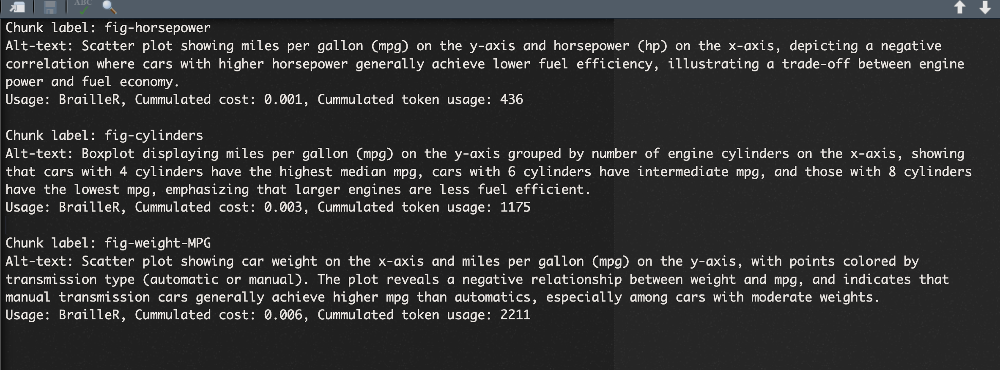

# autoAlt <a href="https://numbats.github.io/autoAlt/"></a>

autoAlt is a demo R package for automatically generating alt-text from QMD and RMD files. It includes the `generate_alt_text()` function, which uses Ellmer and BrailleR to create alt-text for plots in your documents.

# Install

You can install the development version from GitHub:

```
remotes::install_github("numbats/autoAlt")
```

It depends on having [BrailleR](https://github.com/ajrgodfrey/BrailleR) which needs to be installed from GitHub.

# Usage

To get started, you will need to get an API key for OpenAI from https://platform.openai.com/api-keys. 

Provide the file path and name for the `qmd` or `Rmd` file you want to process, and an output file path and name. Ensure that all code required to generate graphics is included in the same file. This github repo comes with a `test.qmd` file in the `inst` folder to get you started.

```
autoalt::generate_alt_text("inst/test.qmd", "inst/test-out.txt", api = api)
```

The generate_alt_text() function scans the document for code chunks containing ggplot, geom, and aes, identifying the source code that generates plots. It extracts the chunk label and uses it to locate the corresponding reference paragraph in the text, and sends requests to ChatGPT via Ellmer, combining: the output from BrailleR (when applicable), and a custom system prompt.

In cases where the example is not self-contained, OpenAI's code interpreter is used in place of BrailleR to understand the code and generate alt-text. Output will be saved in a separate `alt-text.txt` file as seen below. The generated alt-text is saved in a separate file called alt-text.txt, as shown below:



# Known errors

If you get 

```
Error in `stringr::str_detect()`:
! `pattern` can't be the empty string (`""`).
Run `rlang::last_trace()` to see where the error occurred.
```

it means one of your R chunks that plots is not formed properly. We'll fix this soon.


# Contribute

Disclaimer: This package is in early development. Currently, it only works with QMD and RMD files where all code chunks are contained within a single document. It does not support workflows where code is stored in a separate R script.


